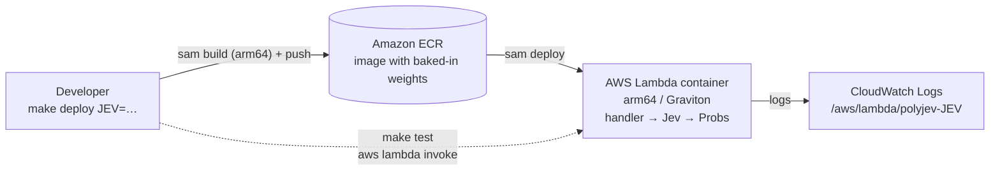

<div align="center">

# polyjev

**Typed answers from any modality, one forward pass.**

[](https://www.python.org/)
[](https://microsoft.github.io/pyright/)
[](https://aws.amazon.com/lambda/)
[](https://docs.astral.sh/uv/)
[](LICENSE)

</div>

A **Jev** is a closed-set classifier built from a generative model that never generates. It renders the input and a lettered list of options into a prompt, runs a single forward pass, and reads the next-token logits of the option letters (`A`, `B`, `C`, …); a log-softmax over just those logits gives a distribution over the options ([reference gist](https://gist.github.com/JGalego/57883950fe3d5c609f34312fc3d5c3d6)). Generating and then parsing costs many decode steps and can produce answers that are misspelled, hedged, or not among the options. A Jev can only return one of its options, because nothing is parsed, and every option comes with a probability.

polyjev has one Jev for each of the 15 non-empty combinations of text, image, audio, and video, and each one is type-safe from end to end:

```python
class Category(StrEnum):
    MEALS = "meals"
    TRAVEL = "travel"
    LODGING = "lodging"
    OFFICE = "office supplies"

jev: Jev[Text, Image, Category] = load()      # asserts each option letter is one distinct token
probs = jev(Text("Boston client visit"), Image(Path("receipt.png")))  # Probs[Category], sums to 1
probs.top                                     # Category.MEALS
```

## Getting Started

### Prerequisites

- [uv](https://docs.astral.sh/uv/)
- [Docker](https://docs.docker.com/get-docker/) with arm64 builds. This works natively on Apple Silicon and Graviton. On x86 Linux, install QEMU first: `docker run --privileged --rm tonistiigi/binfmt --install arm64`
- [AWS CLI](https://aws.amazon.com/cli/) and [SAM CLI](https://docs.aws.amazon.com/serverless-application-model/latest/developerguide/install-sam-cli.html)
- AWS credentials and a default region (`aws configure`, or `AWS_PROFILE` / `AWS_REGION`)
- `ffmpeg` on your `PATH` to run the video Jevs locally (the images ship their own)

### Build / install

```bash
uv sync
```

### Deploy

```bash
make deploy JEV=text-image
```

This builds the arm64 image with the weights baked in, pushes it to a SAM-managed ECR repository (`--resolve-image-repos`), and deploys the `polyjev-text-image` stack without prompting. `make destroy JEV=text-image` removes both.

### Test

```bash
make local JEV=text-image   # pytest on this machine: probabilities sum to 1 and the top label is right
make local                  # the same for all 15 Jevs
make test JEV=text-image    # invokes the deployed Lambda with sample.* and pretty-prints Probs
make check                  # pyright --strict, also enforced in CI
```

A local run downloads the weights once into `~/.cache/polyjev` (override with `JEV_WEIGHTS`).

## Architecture (AWS)



Each stack is one container-image function with no API Gateway and no public URL, so the only way to call it is `lambda:InvokeFunction`. Requests are JSON: `text` is a string, and `image`, `audio`, and `video` are base64. The response is `{"top": label, "probs": {label: p}}`. Video is sampled as `FRAMES = 4` evenly spaced frames. In the combinations that include audio, the audio comes from the clip's own soundtrack. Both are extracted with ffmpeg and fed through the model's image and audio paths.

**Cold starts.** Weights are downloaded while the image is built, so a cold start downloads nothing. The model is loaded on the first invoke rather than in the 10-second init phase: Lambda streams the image from ECR, and the GGUF weights are memory-mapped from it. That is why the timeout is the full 900 s. Warm invocations reuse the loaded model.

**Memory sizing.** Each Jev's `MemorySize` in `template.yaml` is its measured peak RSS plus headroom: about 0.9 GB for SmolVLM2-500M, 2.4 GB for Qwen3-1.7B, and 4.8 GB for Gemma 4 E2B. Lambda allocates vCPUs in proportion to memory (6 vCPUs at 10,240 MB), and a forward pass is CPU-bound, so raising the memory up to 10,240 MB buys lower latency. New AWS accounts may be capped at 3,008 MB until the quota is raised.

Every folder runs on **llama-cpp-python** with GGUF weights, plus a multimodal projector (`mmproj`) fed through libmtmd for image and audio. None needed the `transformers` fallback.

| Folder | Demo task | Options | Model (GGUF) | Backend | Memory |
| --- | --- | --- | --- | --- | --- |
| `text` | Email triage | legitimate · spam · phishing | Qwen3-1.7B Q8_0 | llama-cpp-python | 4096 MB |
| `image` | Chart type | bar · line · pie · scatter | SmolVLM2-500M-Video Q8_0 + mmproj | llama-cpp-python + mtmd | 3008 MB |
| `audio` | Voicemail intent | billing · cancel · support · sales | Gemma 4 E2B Q4_0 + mmproj | llama-cpp-python + mtmd | 8192 MB |
| `video` | Installer outcome from a screen recording | succeeded · failed · still running | SmolVLM2-500M-Video Q8_0 + mmproj | llama-cpp-python + mtmd | 3008 MB |
| `text-image` | Expense category from note + receipt | meals · travel · lodging · office supplies | SmolVLM2-500M-Video Q8_0 + mmproj | llama-cpp-python + mtmd | 3008 MB |
| `text-audio` | Customer's spoken reply to an order read-back | confirms · wants changes · cancels | Gemma 4 E2B Q4_0 + mmproj | llama-cpp-python + mtmd | 8192 MB |
| `text-video` | Does a screen recording reproduce a bug report? | reproduced · not reproduced | Gemma 4 E2B Q4_0 + mmproj | llama-cpp-python + mtmd | 8192 MB |
| `image-audio` | Spoken command → button on screen | Save · Don't Save · Cancel | Gemma 4 E2B Q4_0 + mmproj | llama-cpp-python + mtmd | 8192 MB |
| `image-video` | Does a reference logo appear in a clip? | present · absent | SmolVLM2-500M-Video Q8_0 + mmproj | llama-cpp-python + mtmd | 3008 MB |
| `audio-video` | Ad compliance: spoken vs on-screen price | match · differ | Gemma 4 E2B Q4_0 + mmproj | llama-cpp-python + mtmd | 8192 MB |
| `text-image-audio` | Support ticket routing (subject + screenshot + voice note) | billing · account access · bug · feature | Gemma 4 E2B Q4_0 + mmproj | llama-cpp-python + mtmd | 8192 MB |
| `text-image-video` | Missing-parcel claim (claim + delivery photo + doorbell cam) | never delivered · stolen · still there | Gemma 4 E2B Q4_0 + mmproj | llama-cpp-python + mtmd | 8192 MB |
| `text-audio-video` | Fact-check a claim against a recorded talk | supported · refuted · not enough info | Gemma 4 E2B Q4_0 + mmproj | llama-cpp-python + mtmd | 8192 MB |
| `image-audio-video` | Return triage (listing photo + unboxing clip) | as described · damaged · wrong item | Gemma 4 E2B Q4_0 + mmproj | llama-cpp-python + mtmd | 8192 MB |
| `text-image-audio-video` | Incident severity (alert + dashboard + narrated status page) | SEV1 · SEV2 · SEV3 | Gemma 4 E2B Q4_0 + mmproj | llama-cpp-python + mtmd | 8192 MB |

I picked each model as the smallest one that got its demo right. SmolVLM2-500M handles the single-image and simple video questions. Gemma 4 E2B handles every task with audio, and the vision tasks that need cross-checking evidence, where SmolVLM2 guessed. Ultravox 1B and Qwen2.5-Omni 3B also load through libmtmd. Ultravox was near chance on the voicemail demo. Qwen2.5-Omni was right but about 5× slower than Gemma, because it pads every clip to 30 s of audio. The `sample.*` inputs are synthetic: rendered with Pillow and matplotlib, with speech from Piper's public-domain LJSpeech voice.

## License

[MIT](LICENSE)
