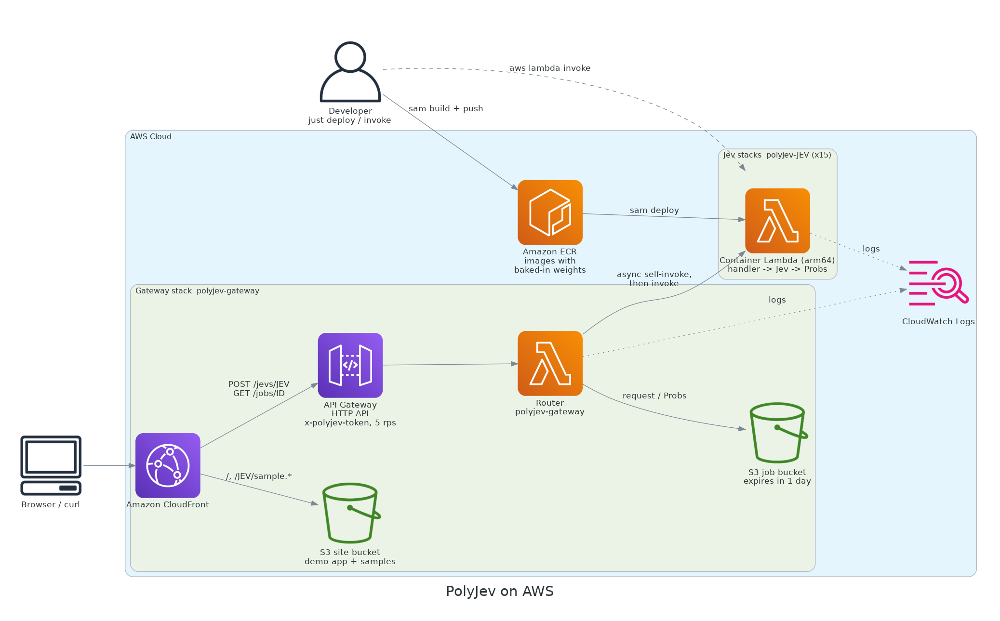

<div align="center">

# polyjev

**Typed answers from any modality, one forward pass.**

[](https://github.com/JGalego/PolyJev/actions/workflows/ci.yml)
[](https://www.python.org/)
[](https://microsoft.github.io/pyright/)
[](https://aws.amazon.com/lambda/)
[](https://docs.astral.sh/uv/)
[](LICENSE)

</div>

A [**Jev**](https://www.nobodywho.ai/posts/jev-in-25-lines/) is a closed-set classifier built from a generative model that never generates. It takes an input and a lettered list of options, puts them into a prompt, and makes a single forward pass. The model’s logits for the option letters are converted into probabilities, so the Jev always selects one of the given options and assigns a probability to each.

`polyjev` provides a Jev for each possible combination of text 📝, image 🖼️, audio 🔊, and video 🎬. Each Jev runs as an arm64 container on [AWS Lambda](https://aws.amazon.com/lambda/), with an optional [API Gateway](https://aws.amazon.com/api-gateway/) and [CloudFront](https://aws.amazon.com/cloudfront/) frontend that can also serve a demo app.

```python
class Category(StrEnum):
    MEALS = "meals"
    TRAVEL = "travel"
    LODGING = "lodging"
    OFFICE = "office supplies"

jev: Jev[Text, Image, Category] = load()      # asserts each option letter is one distinct token
probs = jev(Text("Boston client visit"), Image(Path("receipt.png")))  # Probs[Category], sums to 1
probs.top                                     # Category.MEALS
```

## Getting Started

### Prerequisites

- ⚡ [uv](https://docs.astral.sh/uv/)
- 🐋 [Docker](https://docs.docker.com/get-docker/) with the [buildx](https://docs.docker.com/build/concepts/overview/#buildx) plugin (images are built with BuildKit) and arm64 builds. This works natively on Apple Silicon and Graviton. On x86 Linux, install QEMU first: `docker run --privileged --rm tonistiigi/binfmt --install arm64`
- ☁️ [AWS CLI v2](https://docs.aws.amazon.com/cli/latest/userguide/getting-started-install.html) (2.32 or later, for `aws login`) and a recent 🦫 [SAM CLI](https://docs.aws.amazon.com/serverless-application-model/latest/developerguide/install-sam-cli.html) with `--use-buildkit` (tested with 1.166). Older releases such as 1.146 can't talk to Docker Engine 29 and fail with "requires a container runtime".
    - AWS credentials: run `aws login`. It signs you in through the browser with your AWS console credentials, asks for a default region the first time, and stores short-lived credentials instead of long-lived access keys.
- 🎞️ [ffmpeg](https://ffmpeg.org/) on your `PATH` to run the video Jevs locally (the images ship their own)
- 🤖 [just](https://just.systems/) (optional), a command runner that can be installed with `uv tool install rust-just`, makes it easy to run, deploy, and manage Jevs locally and on AWS. See [Just](#just).

### Build / install

```bash
uv sync
```

### Deploy

```bash
make deploy JEV=text-image
```

This builds the arm64 image with the weights baked in, pushes it to a SAM-managed ECR repository (`--resolve-image-repos`), and deploys the `polyjev-text-image` stack without prompting. `make destroy JEV=text-image` removes both.

### Test

```bash
make local JEV=text-image   # pytest on this machine: probabilities sum to 1 and the top label is right
make local                  # the same for all 15 Jevs
make test JEV=text-image    # invokes the deployed Lambda with sample.* and pretty-prints Probs
make check                  # pyright --strict, also enforced in CI
```

A local run downloads the weights once into `~/.cache/polyjev` (override with `JEV_WEIGHTS`). The gateway and the demo app are deployed with just; see [Just](#just).

## Just

| Command | What it does |
| --- | --- |
| `just login` | `aws login`: sign in to AWS with your console credentials |
| `just test [<jev>]` | Run the tests on this machine: one Jev, or every Jev plus the gateway |
| `just check` | Type-check everything with pyright --strict |
| `just run <jev>` | Build a Jev's Lambda image and run it on this machine (`sam local invoke`) with its sample |
| `just deploy <jev>` | Deploy one Jev to AWS |
| `just deploy gateway` | Deploy API Gateway, the router, and the CloudFront-hosted demo app |
| `just deploy all` | Deploy all 15 Jevs, then the gateway |
| `just max_mb=3008 deploy all` | Skip Jevs whose `MemorySize` is above 3,008 MB (or `export POLYJEV_MAX_MB=3008`) |
| `just invoke <jev>` | Send a Jev's sample to its deployed Lambda and print the Probs |
| `just demo` | Print the demo app's link, with the access token in the URL fragment |
| `just destroy <jev>` / `gateway` / `all` | Delete what `deploy` created |

### Demo examples

Under its inputs, the demo app has ready-made examples for every option of every Jev: legitimate, spam, and phishing emails, the four chart types, voicemails, installer recordings, receipts, doorbell footage, and so on. Pick one, press **Classify**, and the app says whether the top answer matches the expected one. The examples live in [demo/examples/](demo/examples/) and `just deploy gateway` uploads them. `uv run demo/examples/make.py` regenerates them: the images are drawn with Pillow and matplotlib, the speech is synthesized offline with [Piper](https://github.com/OHF-Voice/piper1-gpl), and each video is four 2-second scenes, one for each frame a Jev samples. `uv run python demo/examples/check.py [<jev> ...]` runs them through the real Jevs on this machine and reports any that miss.

## Architecture



Each Jev stack is one container-image function with no public URL of its own. You can call it directly with `lambda:InvokeFunction`, or through the optional gateway stack in `gateway/`. That stack is serverless too: an Amazon API Gateway HTTP API in front of all 15 functions, and a CloudFront distribution that serves the demo app from a private S3 bucket and forwards `/jevs/*` and `/jobs/*` to the API, so the app and the API share one HTTPS origin. API Gateway's integrations time out after 30 s, but a Jev can take longer, and minutes on a cold start. So `POST /jevs/{jev}` stores the request in S3, returns `202 {"job": id}`, and the router invokes itself asynchronously to call `polyjev-{jev}`, waiting up to 900 s. `GET /jobs/{id}` returns `202` while the job runs, then the Probs or `{"error": …}`. Every API route requires an `x-polyjev-token` header, and the stage is throttled to 5 requests per second. `GET /jevs` says which Jevs are deployed, and `POST /jevs/{jev}` for one that isn't returns `404 {"error": …, "deployed": false}`, so the demo app greys out Jevs that a partial deploy (`just max_mb=3008 deploy all`) skipped. Requests are JSON: `text` is a string, and `image`, `audio`, and `video` are base64. The response is `{"top": label, "probs": {label: p}}`. Video is sampled as `FRAMES = 4` evenly spaced frames. In the combinations that include audio, the audio comes from the clip's own soundtrack. Both are extracted with ffmpeg and fed through the model's image and audio paths.

**Cold starts.** Weights are downloaded while the image is built, so a cold start downloads nothing. The model is loaded on the first invoke rather than in the 10-second init phase: Lambda streams the image from ECR, and the GGUF weights are memory-mapped from it. That is why the timeout is the full 900 s. Warm invocations reuse the loaded model.

**Memory sizing.** Each Jev's `MemorySize` in `template.yaml` is its measured peak RSS plus headroom: about 0.9 GB for [SmolVLM2-500M](https://huggingface.co/ggml-org/SmolVLM2-500M-Video-Instruct-GGUF), 2.4 GB for [Qwen3-1.7B](https://huggingface.co/Qwen/Qwen3-1.7B-GGUF), and 4.8 GB for [Gemma 4 E2B](https://huggingface.co/ggml-org/gemma-4-E2B-it-GGUF). Lambda allocates vCPUs in proportion to memory (6 vCPUs at 10,240 MB), and a forward pass is CPU-bound, so raising the memory up to 10,240 MB buys lower latency. New AWS accounts may be capped at 3,008 MB in every region until the quota is raised. Until then, `just max_mb=3008 deploy all` deploys the five Jevs that fit (`text`, `image`, `video`, `text-image`, `image-video`) and the gateway.

Every folder runs on **llama-cpp-python** with GGUF weights, plus a multimodal projector (`mmproj`) fed through libmtmd for image and audio. None needed the `transformers` fallback.

| Modalities | Demo task | Options | Model (GGUF) | Backend | Memory |
| --- | --- | --- | --- | --- | --- |
| [📝](text/ "text") | Email triage | legitimate · spam · phishing | [Qwen3-1.7B](https://huggingface.co/Qwen/Qwen3-1.7B-GGUF) Q8_0 | llama-cpp-python | 3008 MB |
| [🖼️](image/ "image") | Chart type | bar · line · pie · scatter | [SmolVLM2-500M-Video](https://huggingface.co/ggml-org/SmolVLM2-500M-Video-Instruct-GGUF) Q8_0 + mmproj | llama-cpp-python + mtmd | 3008 MB |
| [🔊](audio/ "audio") | Voicemail intent | billing · cancel · support · sales | [Gemma 4 E2B](https://huggingface.co/ggml-org/gemma-4-E2B-it-GGUF) Q4_0 + mmproj | llama-cpp-python + mtmd | 8192 MB |
| [🎬](video/ "video") | Installer outcome from a screen recording | succeeded · failed · still running | [SmolVLM2-500M-Video](https://huggingface.co/ggml-org/SmolVLM2-500M-Video-Instruct-GGUF) Q8_0 + mmproj | llama-cpp-python + mtmd | 3008 MB |
| [📝🖼️](text-image/ "text-image") | Expense category from note + receipt | meals · travel · lodging · office supplies | [SmolVLM2-500M-Video](https://huggingface.co/ggml-org/SmolVLM2-500M-Video-Instruct-GGUF) Q8_0 + mmproj | llama-cpp-python + mtmd | 3008 MB |
| [📝🔊](text-audio/ "text-audio") | Customer's spoken reply to an order read-back | confirms · wants changes · cancels | [Gemma 4 E2B](https://huggingface.co/ggml-org/gemma-4-E2B-it-GGUF) Q4_0 + mmproj | llama-cpp-python + mtmd | 8192 MB |
| [📝🎬](text-video/ "text-video") | Does a screen recording reproduce a bug report? | reproduced · not reproduced | [Gemma 4 E2B](https://huggingface.co/ggml-org/gemma-4-E2B-it-GGUF) Q4_0 + mmproj | llama-cpp-python + mtmd | 8192 MB |
| [🖼️🔊](image-audio/ "image-audio") | Spoken command → button on screen | Save · Don't Save · Cancel | [Gemma 4 E2B](https://huggingface.co/ggml-org/gemma-4-E2B-it-GGUF) Q4_0 + mmproj | llama-cpp-python + mtmd | 8192 MB |
| [🖼️🎬](image-video/ "image-video") | Does a reference logo appear in a clip? | present · absent | [SmolVLM2-500M-Video](https://huggingface.co/ggml-org/SmolVLM2-500M-Video-Instruct-GGUF) Q8_0 + mmproj | llama-cpp-python + mtmd | 3008 MB |
| [🔊🎬](audio-video/ "audio-video") | Ad compliance: spoken vs on-screen price | match · differ | [Gemma 4 E2B](https://huggingface.co/ggml-org/gemma-4-E2B-it-GGUF) Q4_0 + mmproj | llama-cpp-python + mtmd | 8192 MB |
| [📝🖼️🔊](text-image-audio/ "text-image-audio") | Support ticket routing (subject + screenshot + voice note) | billing · account access · bug · feature | [Gemma 4 E2B](https://huggingface.co/ggml-org/gemma-4-E2B-it-GGUF) Q4_0 + mmproj | llama-cpp-python + mtmd | 8192 MB |
| [📝🖼️🎬](text-image-video/ "text-image-video") | Missing-parcel claim (claim + delivery photo + doorbell cam) | never delivered · stolen · still there | [Gemma 4 E2B](https://huggingface.co/ggml-org/gemma-4-E2B-it-GGUF) Q4_0 + mmproj | llama-cpp-python + mtmd | 8192 MB |
| [📝🔊🎬](text-audio-video/ "text-audio-video") | Fact-check a claim against a recorded talk | supported · refuted · not enough info | [Gemma 4 E2B](https://huggingface.co/ggml-org/gemma-4-E2B-it-GGUF) Q4_0 + mmproj | llama-cpp-python + mtmd | 8192 MB |
| [🖼️🔊🎬](image-audio-video/ "image-audio-video") | Return triage (listing photo + unboxing clip) | as described · damaged · wrong item | [Gemma 4 E2B](https://huggingface.co/ggml-org/gemma-4-E2B-it-GGUF) Q4_0 + mmproj | llama-cpp-python + mtmd | 8192 MB |
| [📝🖼️🔊🎬](text-image-audio-video/ "text-image-audio-video") | Incident severity (alert + dashboard + narrated status page) | SEV1 · SEV2 · SEV3 | [Gemma 4 E2B](https://huggingface.co/ggml-org/gemma-4-E2B-it-GGUF) Q4_0 + mmproj | llama-cpp-python + mtmd | 8192 MB |

## License

[MIT](LICENSE)
